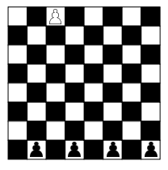

Rókafogó játék
=
A rókafogó játék egy sakktáblán játszható 4 sötét és 1 világos gyaloggal, 
amelyek a keződállásban a lentebbi ábrán látható módon helyezkednek el. 

A sötét gyalogok a kutyák, a világos pedig a róka. Az egyik játékos a kutyákat,
a másik a rókát irányítja. A játékosok felváltva következnek lépni:
* A kutyák átlósan léphetnek egy mezőt, de csak előre.
* A róka szintén átlósan egy mezőt léphet, de mozoghat hátrafelé is. 
Viszont nem léphet olyan mezőre, amelyre kutya is léphet
---
A rókát irányító játékos akkor nyer, ha a figurát a kutyák mögé vezeti.
A kutyákat vezető játékos, akkor nyer ha a rókát olyan helyzetbe kényszeríti, amelyben 
nem tud lépni.
